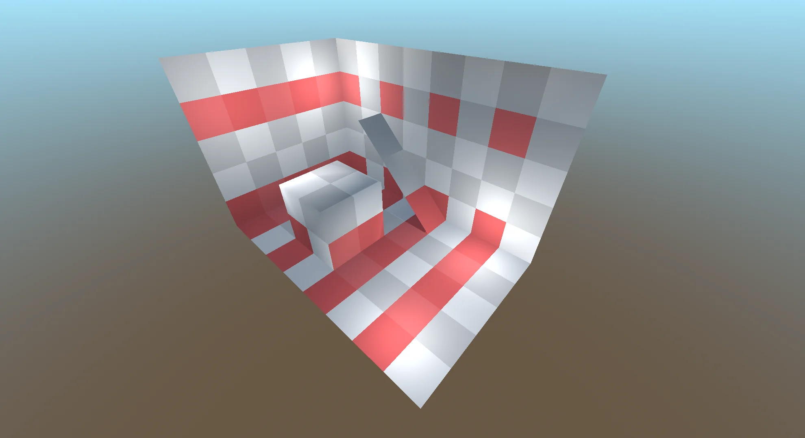

# Selecting Blocks

There are several functions in ruleset that are responsible for selecting certain blocks by condition. Blocks selectors are limited by blocks scope.

## Blocks Selection Functions

Let's take this scene, for example, and apply various block selector rules. Selected blocks will be colored red.


We will be using next style script.

```gdscript
@tool
extends RoommateStyle


func _build_rulesets() -> void:
    var ruleset := create_ruleset()
    # block selection code goes here
    ruleset.select_all_parts().surfaces.color.accumulate(Color.RED, 0.8)
```

### select_all_blocks

Simply selects all blocks in the scope.

```gdscript
ruleset.select_all_blocks()
```


### select_blocks_by_type

Select all blocks of certain type. For example, we will select all oblique blocks.

```gdscript
ruleset.select_blocks_by_type(RoommateBlock.OBLIQUE_TYPE)
```


### select_blocks_by_extreme

Select blocks by extreme positions in current scope. 

```gdscript
ruleset.select_blocks_by_extreme(Vector3i.FORWARD)
```


If you pass 0 as a value for certain axis, it will be ignored, ie selection will be extruded along that axis. Number means how much rows will be selected from min/max positions. 

```gdscript
ruleset.select_blocks_by_extreme(Vector3i(2, 0, -1))
```


### select_edge_blocks

Block is selected if it's near edge. You pass `RoommateSegment` object to `select_edge_blocks` 

```gdscript
var segment_left := RoommateSegment.new(Vector3i.LEFT, 0)
ruleset.select_edge_blocks([segment_left])
```


You can change `max_steps` parameter, 

```gdscript
var segment_left := RoommateSegment.new(Vector3i.LEFT, 1)
ruleset.select_edge_blocks([segment_left])
```


If you pass multiple segments, block is selected if both of them are satisfied.

```gdscript
var segment_left := RoommateSegment.new(Vector3i.LEFT, 0)
var segment_down := RoommateSegment.new(Vector3i.DOWN, 0)
ruleset.select_edge_blocks([segment_left, segment_down])
```


There are `select_edge_blocks_axis` function. It produces same result as above example

```gdscript
ruleset.select_edge_blocks_axis(Vector3i(-1, -1, 0))
```

### select_interval_blocks

You can select blocks by interval.

```gdscript
ruleset.select_interval_blocks(Vector3i(2, 0, 0))
```


a

```gdscript
ruleset.select_interval_blocks(Vector3i(2, 3, 0))
```



### select_inner_blocks

a

```gdscript
var segment_forward := RoommateSegment.new(Vector3.FORWARD, 0)
ruleset.select_inner_blocks([segment_forward])
```


a

```gdscript
var segment_forward := RoommateSegment.new(Vector3.FORWARD, 1)
ruleset.select_inner_blocks([segment_forward])
```


a

```gdscript
var segment_forward := RoommateSegment.new(Vector3.FORWARD, 0)
var segment_up := RoommateSegment.new(Vector3.UP, 0)
ruleset.select_inner_blocks([segment_forward, segment_up])
```


a

```gdscript
ruleset.select_inner_blocks_uniform([Vector3i.FORWARD, Vector3i.UP], 0)
```

```gdscript
ruleset.select_inner_blocks_axis(Vector3i(0, 1, -1))
```

### select_random_blocks

a

```gdscript
var rng := RandomNumberGenerator.new()
rng.seed = hash("Roommate is cool!")
ruleset.select_random_blocks(0.4, rng)
```


a

### select_blocks

a

```gdscript
var prepare := func (blocks_scope: Dictionary) -> Dictionary:
    var max_y: float = NAN
    var min_y: float = NAN
    for block_position in blocks_scope:
        max_y = maxf(max_y, block_position.y)
        min_y = minf(min_y, block_position.y)
    return { "sin_center": roundi((max_y - min_y) / 2 + min_y) }

var is_block_selected := func (offset_position: Vector3i, block: RoommateBlock,
        blocks_scope: Dictionary, prepared_vars: Dictionary) -> bool:
    var sin_center := prepared_vars["sin_center"] as int
    return (roundi(sin(offset_position.x)) + sin_center) == offset_position.y

ruleset.select_blocks(is_block_selected, prepare)
```


## Blocks Selector Inclusion modes

asd

```gdscript
@tool
extends RoommateStyle


func _build_rulesets() -> void:
    var ruleset := create_ruleset()
    ruleset.select_blocks_by_extreme(Vector3(0, -1, -1))
    ruleset.select_blocks_by_extreme(Vector3(0, -1, 1))
    var selector := ruleset.select_blocks_by_extreme(Vector3(1, -1, 0))
    # selector mode changing code goes here
    ruleset.select_all_parts().surfaces.color.accumulate(Color.RED, 0.8)
```


### include

a

```gdscript
selector.include()
```

a

### exclude

a

```gdscript
selector.exclude()
```


### invert

a

```gdscript
selector.invert()
```


### intersect

a

```gdscript
selector.intersect()
```


